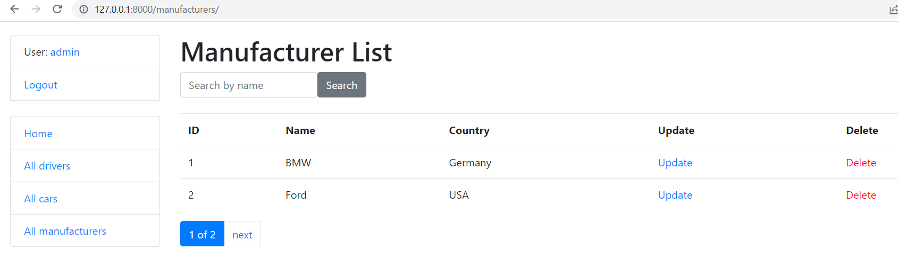

# Taxi Service

Django project to manage Taxi Service that includes cars, drivers and manufacturers

[link for the project] (paste your link here)

## Installation

Python3 must be already installed

```shell
git clone https://github.com/LaskoA/taxi_project_mate
cd taxi_project_mate
python3 -m venv venv
source venv/bin/activate
pip install -r requirements.txt
python manage.py runserver # starts Django server
```

## Features

- Authentication for Drivers / Users
- Ability to view detailed information about
- Possibility to manage list of manufacturers, cars and dirvers 

## Demo


